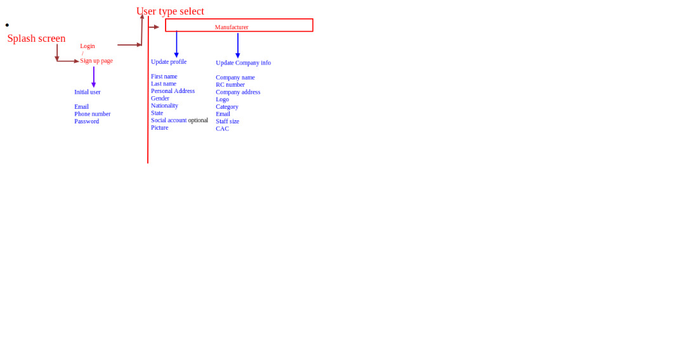
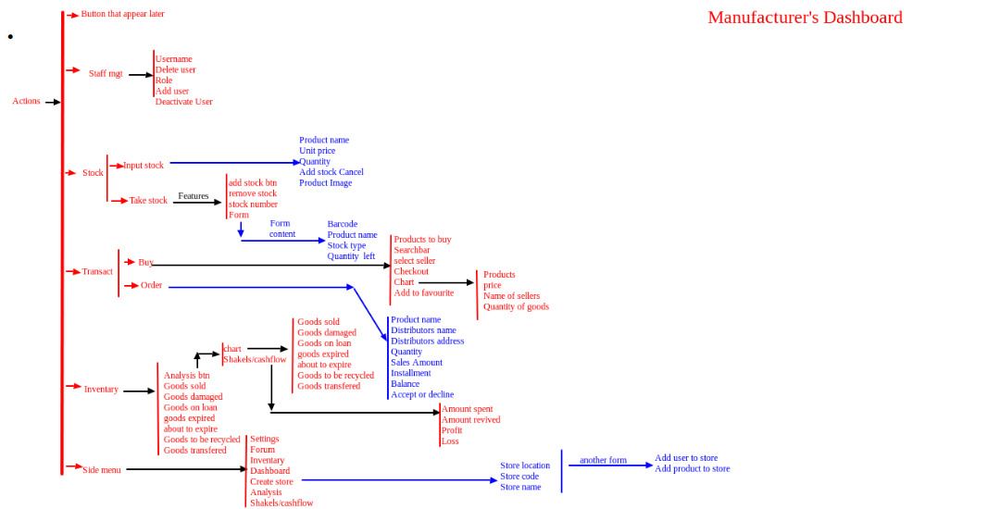
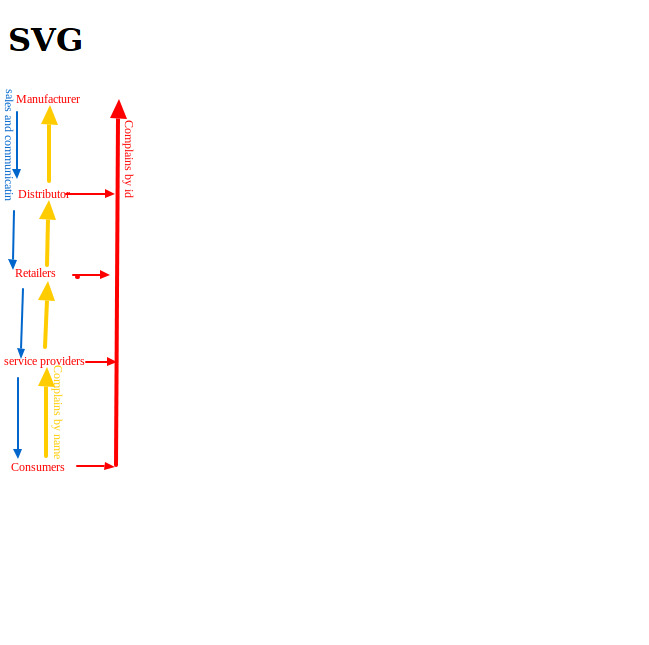

## Introduction

### User Types

- Manufacturers::::::: Can have access to all other user types. Needs to know data about their distributors. Needs invemtory of raw materials and finished products. Has machines
- Distributors::::::::: has idea of his stock inventory. Needs to know how many goods he's getting from each manufactures.
- Retailers::::::::::: They need stock of available data, what is a
- Service Providers--Responsible for conneting buyer to seller. They don't own a shop but knows the people that have a commodity. They can be marketing the stuffs online.
- Consumers:::::::::::::::::::

Functionality

- Social platform :::::::: User types can communicate with each other concerning goods. The service provider.

## User Story

### As a manufacturer

Sign up as Manufacturer

- Login Form ::::::::::
  - email or phoneNumber and
  - password.
- Login Page -> Sign up -> With dropDown of Sign up ::::::::::::::
  - email,
  - phoneNumber,
  - password,
  - userType.
- Update Form :::::::::::
  - Person Profile and Company Profile
    - Person Profile
      - email,
      - phoneNumber,
      - First Name,
      - last Name,
      - Personal address,
      - Gender,
      - Nationality,
      - Social accounts,
      - profile Image.
  - Company aprofile
    - Compnay Name,
    - rc Number,
    - Logo,
    - Company Address,
    - Company mail,
    - Category,
    - Staff Strength(range),
    - CAC,

Landing Page has

- Account Mgt:
  - Add user, deactivate, role
- Stock:
  - Take Stock \* Include options of adding a number of forms and removing
    - product name
    - qty
    - stock type
    - date
    - (save, add more, remove)
  - Input Stock
    - product name
    - unit price
    - qty
    - date
    - image
    - (save, add more, remove)
  - Transact

The Inventory App Meeting

The brainstorm meeting on the inventory App on Friday 9th August 2019 commenced by 1pm and ended by 5pm at LearnFactory Nigeria main office. The team had in attendance all learnfactory developers - Isaac, Lawrence, Chidera, Chibuike, Ezekiel, George, Bernadine, with three learnfactory interns - Chibuike Ezeoke, Ubanna Dan Ekeh, Olusegun. To complete the team, Daberechi for UI came from Onitsha. In total there were eleven(11) persons present.

The purpose of the meeting was to amongst other things have a brainstorm session on how to tell the user story of the inventory App; including but no limited to discussing the possible features that the unique App should have. The expectation was that everybody present should contribute in ensuring that by the end of the day, there is a working MVP( minimal viable product) design to begin with, for which Daberechi will also from there, be able to produce mock up screens that follows the same user story.

The meeting commenced with Lawrence anchoring the process. First he began by welcoming everybody. Next he proceeded to explaining the concept of the inventory App so the team can be abreast of the current status and expectation of the App. He proceeded with the PDF document containing the specifications of the App and there the team learnt that there were going to be four levels of user Types or five, as they later began to realize it should be:

Here are the user types

- Manufacturers,
- distributors,
- retailers,
- service providers and
- consumers.

He proceeded on certain features inherent of the user types as contained in the pdf document.
After he had made an end of lecturing everyone on the role of each user type, every member of the team proceeded to give their contribution to what the different types should and shouldn't do.
This session was quite interesting.

The next session focused on taking each of the user Type and telling their respective user story. Using the PDF document as a guide,the team started, as continued by Lawrence to discuss the user story from the point of view of - the Manufacturer user Type.

The team of eleven realized that the manufacturer was at the Apex of the chain. He will be responsible for manufacturing goods, this gives him direct access to two kinds of customers - the user type distributor that supplies raw materials to him and the user type distributor that sells his finished products for him. The manufacturer user story began from login to sign up to the number and kinds of information needed for sign up; to his dashboard with nothing for now which the team later concluded will be a detailed analysed summary of the state of his business with informations pulled from the PDF document; followed by the manufacturer completing his sign up details to get him started.

The details will be of two types. Personal profile and compant profile.

The - Personal Profile will contain the following informations

- email,
- phone Number,
- First Name,
- last Name,
- Personal address,
- Gender,
- Nationality,
- Social accounts,
- profile Image.

The - Company profile will contain the following informations

- Compnay Name,
- rc Number,
- Logo,
- Company Address,
- Company mail,
- Category,
- Staff Strength(with range),
- CAC,

The team agreed that on signup, there should be a dropdown so that a new user can be able to sign up as a user type by selecting.

At this intermittent session, Isaac called on Daberechi to take up the anchoring and try to produce a minimalistic wireframe of what the present dashboard should like: Over so many adjustments they concluded on having the following on the dashboard

- a detailed analysed summary inluding charts of the state of the business with information about finances, suppply chain, staff, stores, stock etc.

There will be a Bottom tab with major functionalities viz:

1. Staff management : -- For managing staff, changing staff roles, deactivate a staff and staff to a store etc,

2. Inventory : - For taking care of stock, taking stock, input stock etc, giving detailed information about a particular stock such as goods on loan, in stock, sold, expiry date, number of units etc.

   - Take Stock \* Includes options for adding a number of forms and removing a number of forms with the details below:

     - product name
     - qty
     - stock type
     - date
     - (save, add more, remove)

   - Input Stock will have the details below:
     - product name
     - unit price
     - qty
     - date
     - image
     - (save, add more, remove)

3. Transact :- For buying and sales of products and raw materials needed for production. Here the team also discussed extensively on the chain of supplying and buying a product.

4. Stores :- For managing stores, create a store, remove a store, assign different levels of staff to a store etc.

At this point other functionalies were incorporated such as the social platform for different users on the platform and the informations contained on the PDF document.

Finally, one lady and ten man team were able to come to a conclusive end that getting the inventory App done will be feasible.

After the manufacturer's screen is ready, the team hope to use the same logic for other user types.

Please Find attached some graphics displaying a minimalistic user story flow as produced by Bernadine Eze May.

